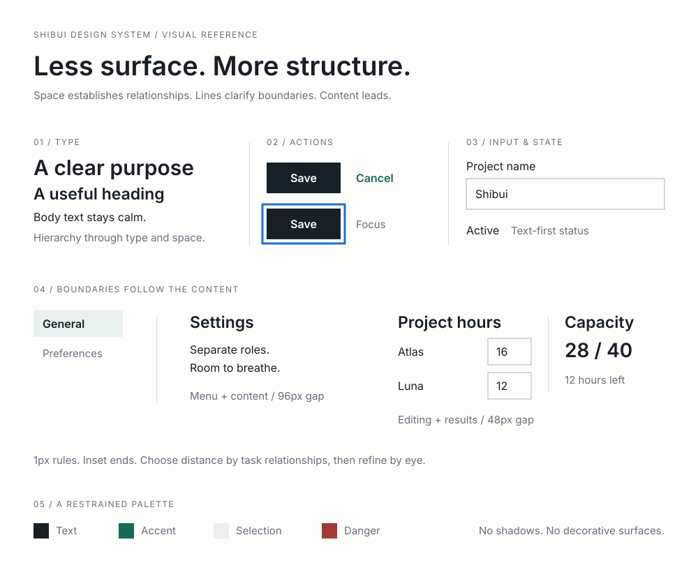

# Shibui Design System

![shib[ui] wordmark](assets/shibui-logo.svg)

**Less surface. More structure.**

Shibui is a framework-independent design system for quiet, structured interfaces. It treats information architecture as part of visual design: keep the context needed for the current task available together, reveal secondary detail on demand, and establish hierarchy with space, alignment, and type before adding surfaces or borders.



## Start here

- Read the [principles](docs/principles.md) before designing a view.
- Choose the interaction model (reading page or GUI tool) and read the [standard style](docs/style.md) separately from the shared principles.
- Use the [review rules](docs/rules.md) and machine-readable [`shibui.yaml`](shibui.yaml) as implementation constraints.
- Link [`css/tokens.css`](css/tokens.css), [`css/base.css`](css/base.css), and [`css/components.css`](css/components.css), in that order.
- Open [`index.html`](index.html) to browse eight framework-free reference pages.
- Give Coding Agents [`skills/shibui/SKILL.md`](skills/shibui/SKILL.md) for implementation and review workflows.

## Install the agent skill

Install with either [skills](https://github.com/vercel-labs/skills) or [GitHub CLI](https://cli.github.com/manual/gh_skill_install):

```sh
npx skills add mfakane/shibui --skill shibui
gh skill install mfakane/shibui shibui
```

For Codex at user scope, use `npx skills add mfakane/shibui --skill shibui --agent codex --global` or `gh skill install mfakane/shibui shibui --agent codex --scope user`. Use a GitHub CLI version that provides `gh skill`.

The skill includes principles, review rules, CSS, and runnable examples. Once installed, it needs no network access or source checkout. This installs agent guidance and reference assets; it does not automatically add CSS to your application.

## Maintaining the skill bundle

Edit `skills/shibui/SKILL.md`, `review.md`, and `agents/openai.yaml` directly. The root `docs/`, `css/`, `examples/`, `index.html`, `shibui.yaml`, and `LICENSE` remain the canonical reference sources. The bundle's `references/`, `assets/`, and `LICENSE` are generated; do not edit those copies. Prettier checks canonical sources; synchronization owns the generated copies.

After editing canonical sources, run:

```sh
npm run format
npm run skill:sync
npm run skill:check
python3 tests/validate_skill.py
```

Commit the generated files so repository-based installers can copy a complete skill without a build step. CI rejects missing, stale, and unexpected bundle files and validates an isolated copy's local links.

## Reference pages

| Page | Primary task | Disclosure pattern |
| --- | --- | --- |
| [Column project list](examples/columns.html) | Find a project | Persistent workspace navigation |
| [Column settings](examples/columns-settings.html) | Adjust workspace settings | Local section navigation inside the app layout |
| [Planning guide](examples/page.html) | Read a planning method | Optional background notes |
| [Allocation tool](examples/tool.html) | Compare and adjust a plan | Keep inputs and results together |
| [Settings](examples/settings.html) | Choose a settings category | Navigate to a focused category |
| [Projects](examples/list.html) | Find and open a project | Search/filter, then drill down |
| [Project detail](examples/detail.html) | Understand one project | Expand optional details |
| [Organization form](examples/form.html) | Update organization details | Reveal advanced fields on demand |

The guide and allocation tool demonstrate the same principles at different task-appropriate densities. The allocation tool updates totals locally; edits are not saved. The column examples use CSS-only dividers that follow the content column height; no JavaScript is required. The remaining reference pages are static layout examples.

No build step or frontend dependency is required. Serve the repository with any static server, for example `python3 -m http.server 8000`.

## Browser support

The reference CSS targets current evergreen browsers. It respects reduced-motion preferences and uses native HTML controls wherever possible.

## Source formatting

The HTML and CSS are references for people as well as browsers. Keep them expanded and consistently formatted; avoid committing minified source.

Use Node.js 24 and npm for the development tools:

```sh
npm ci
npm run format
npm run format:check
python3 tests/validate.py
```

Prettier is pinned to an exact version with a committed lockfile, following the [Prettier installation guidance](https://prettier.io/docs/install). It formats HTML (including embedded JavaScript), SVG, CSS, JavaScript, JSON, and YAML. Markdown prose and Python are outside the formatter's scope. The configuration uses two-space indentation, LF line endings, and an 80-column target. HTML uses `htmlWhitespaceSensitivity: "ignore"` so tags and nested controls remain easy to read, including components whose block or flex layout is defined in CSS. When adding whitespace-sensitive inline content, keep the intended spaces explicit and use a targeted `<!-- prettier-ignore -->` comment if formatting would change the text's spacing.

Editor integrations should use the project's installed Prettier and configuration; `.editorconfig` also supplies basic indentation and line-ending defaults. CI checks formatting and the existing reference validator on pull requests and pushes to `master`.

Node.js is only needed to maintain the source. Viewing or serving the reference pages still requires no build step.

## License

[CC0 1.0 Universal](LICENSE)
